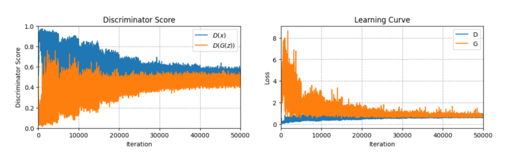
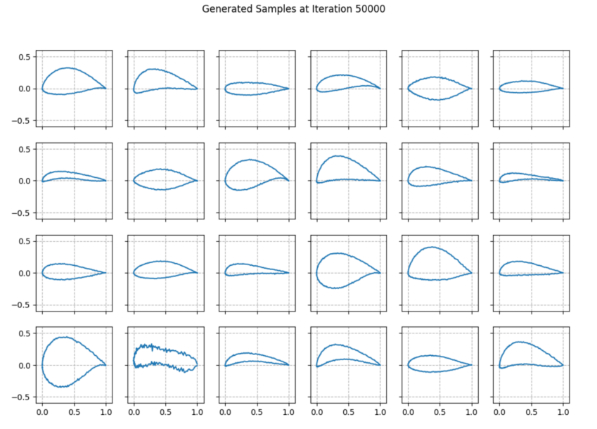

+++
date = '2025-05-20T10:00:00-04:00'
draft = false
title = 'Tutorial & Reflections: Generative Adversarial Networks (GANs) for Airfoil Generation'
tags = ["GAN", "PyTorch", "Deep Learning", "Generative Models", "Tutorial", "Learning Reflections"]
+++

## Introduction

Following our exploration of VAEs, this post delves into another powerful class of generative models: Generative Adversarial Networks (GANs). We'll walk through the fundamentals of GANs, their implementation for generating airfoil shapes using PyTorch, and share key insights and challenges encountered during the training process.

**Setup Notes:**
* This project uses Python 3.10 and PyTorch >= 2.
* Utility functions and an `AirfoilDataset` are assumed to be available.
* No additional imports beyond standard PyTorch and data handling libraries were used.

## Tutorial: Understanding and Implementing GANs

GANs consist of two neural networks, a Generator (G) and a Discriminator (D), trained in a competitive setting.

### 1. GAN Fundamentals: Training Dynamics Insights

Let's start with some core concepts about GAN training dynamics.

**a) Discriminator Output Dynamics**
* **Early Training:**
    * $D(x)$ (Discriminator output for real data): Should be close to 1. The discriminator initially learns to identify real samples easily.
    * $D(G(z))$ (Discriminator output for fake data generated by G): Should be close to 0. The generator's initial outputs are typically poor and easily flagged as fake.
* **As Training Progresses:**
    * $D(x)$ should gradually decrease from near 1 towards 0.5.
    * $D(G(z))$ should gradually increase from near 0 towards 0.5.
    * This occurs as the generator improves, making it harder for the discriminator to distinguish real from fake.
* **Successful Training Indicator:**
    * Both $D(x)$ and $D(G(z))$ converge to approximately 0.5. This means the discriminator is essentially guessing, unable to reliably differentiate real from generated samples, indicating the generator produces realistic samples.
    * If $D(x)$ and $D(G(z))$ remain far apart (e.g., $D(x) \approx 0.9$ and $D(G(z)) \approx 0.1$), it suggests the generator isn't improving or the discriminator is too dominant.

**b) Similar Losses and Discriminator Outputs Early On**
* **Problem:** If generator and discriminator losses are similar, and $D(x)$ and $D(G(z))$ are also similar (e.g., both near 0.5) in early training, it's a concerning sign. It suggests the discriminator cannot distinguish between real and fake samples from the start, which is not the desired initial dynamic.
* **Potential Causes:**
    1.  Discriminator is too weak relative to the generator.
    2.  Imbalanced learning rates.
    3.  Architectural issues.
* **Mitigation Strategies:**
    1.  Strengthen the discriminator (e.g., add layers/width) or simplify the generator.
    2.  Adjust learning rates: Often, the discriminator might need to learn faster initially. Consider increasing the discriminator's learning rate or decreasing the generator's.
    3.  Implement regularization techniques (e.g., spectral normalization, gradient penalties).
    4.  Improve weight initialization.

**c) Discriminator Loss Converges to Zero, Generator Loss Unstable/Large**
* **Discriminator Scores:**
    * $D(x)$ (real data): Very close to 1.
    * $D(G(z))$ (fake data): Very close to 0.
* **Problem:** This indicates the discriminator is "winning too easily" or is too powerful. It perfectly classifies samples, providing minimal useful gradient information to the generator, hindering its learning. Training will likely not be successful.
* **Mitigation Strategies:**
    1.  Weaken the discriminator (e.g., add dropout, reduce capacity, use weight decay).
    2.  Adjust learning rates: Decrease the discriminator's learning rate and/or increase the generator's.
    3.  Use one-sided label smoothing (e.g., target 0.9 for real samples instead of 1) to prevent discriminator overconfidence.
    4.  Consider alternative GAN formulations like WGAN (Wasserstein GAN) for more stable gradients.
    5.  Train the discriminator less frequently than the generator (e.g., update G more times per D update).

### 2. Model Implementation for Airfoil Generation

The task is to generate airfoil profiles, each represented by 200 y-coordinates for predefined x-coordinates.

#### a) Generator
The Generator takes a latent vector $z$ (typically sampled from a Normal distribution) and maps it to an airfoil shape. The architecture uses a sequence of linear layers, activations, and optional batch normalization. The final layer uses `Tanh` activation, as airfoil coordinates are often normalized.

```python
import torch
from torch import nn
from typing import Sequence

class Generator(nn.Module):
    def __init__(
        self,
        latent_size: int,
        output_size: int,
        hidden_sizes: Sequence[int] = [128, 256, 512],
        activation_name: str = 'ReLU',
        batchnorm: bool = True
    ):
        super().__init__()
        activation_fn = getattr(nn, activation_name)
        self.latent_size = latent_size
        self.layers = nn.Sequential()

        current_size = latent_size
        for i, h_size in enumerate(hidden_sizes):
            self.layers.append(nn.Linear(current_size, h_size))
            if batchnorm and i > 0: # Batchnorm typically not applied to the very first layer's input
                self.layers.append(nn.BatchNorm1d(h_size))
            self.layers.append(activation_fn())
            current_size = h_size
        
        self.layers.append(nn.Linear(hidden_sizes[-1], output_size))
        self.layers.append(nn.Tanh())

    def forward(self, z: torch.FloatTensor) -> torch.FloatTensor:
        # z: (batch_size, latent_size)
        # returns: (batch_size, output_size)
        return self.layers(z)

    def generate(self, n_samples: int, device: str = 'cpu') -> torch.FloatTensor:
        # returns: (n_samples, output_size)
        self.to(device)
        z = torch.randn(n_samples, self.latent_size, device=device)
        return self(z)
````

#### b) Discriminator

The Discriminator takes an airfoil shape (either real or generated) and outputs a probability score indicating whether it's real (closer to 1) or fake (closer to 0). It's also an MLP, often using `LeakyReLU` activation and `Dropout` for regularization. The final layer uses `Sigmoid` activation for binary classification.

```python
import torch
from torch import nn
from typing import Sequence

class Discriminator(nn.Module):
    def __init__(
        self,
        input_size: int,
        hidden_sizes: Sequence[int] = [512, 256, 128],
        activation_name: str = 'LeakyReLU',
        dropout_prob: float = 0.3
    ):
        super().__init__()
        if activation_name == 'LeakyReLU':
            activation_fn = lambda: nn.LeakyReLU(0.2)
        else:
            activation_fn = getattr(nn, activation_name)
        
        self.layers = nn.Sequential()
        self.layers.append(nn.Flatten())

        current_size = input_size
        for h_size in hidden_sizes:
            self.layers.append(nn.Linear(current_size, h_size))
            self.layers.append(activation_fn())
            self.layers.append(nn.Dropout(dropout_prob))
            current_size = h_size
            
        self.layers.append(nn.Linear(hidden_sizes[-1], 1))
        self.layers.append(nn.Sigmoid())

    def forward(self, x: torch.FloatTensor) -> torch.FloatTensor:
        # x: (batch_size, input_size)
        # returns: (batch_size, 1)
        return self.layers(x)
```

### 3\. Loss Functions

The standard GAN uses binary cross-entropy loss.

  * **Discriminator Real Loss ($L\_{D\_{real}}$):** $D$ should output 1 for real samples.
    $L\_{D\_{real}} = -\\mathbb{E}\_{x \\sim p\_{data}(x)}[\\log D(x)]$
    Target labels are 1s.

    ```python
    import torch
    from torch.nn import functional as F

    def D_real_loss_fn(D_real: torch.FloatTensor) -> torch.FloatTensor:
        target = torch.ones_like(D_real)
        return F.binary_cross_entropy(D_real, target)
    ```

  * **Discriminator Fake Loss ($L\_{D\_{fake}}$):** $D$ should output 0 for fake samples $G(z)$.
    $L\_{D\_{fake}} = -\\mathbb{E}\_{z \\sim p\_z(z)}[\\log(1 - D(G(z)))]$
    Target labels are 0s.

    ```python
    import torch
    from torch.nn import functional as F

    def D_fake_loss_fn(D_fake: torch.FloatTensor) -> torch.FloatTensor:
        target = torch.zeros_like(D_fake)
        return F.binary_cross_entropy(D_fake, target)
    ```

  * **Total Discriminator Loss ($L\_D$):**
    $L\_D = \\frac{1}{2}(L\_{D\_{real}} + L\_{D\_{fake}})$

  * **Generator Loss ($L\_G$):** $G$ wants $D$ to output 1 for fake samples $G(z)$.
    $L\_G = -\\mathbb{E}\_{z \\sim p\_z(z)}[\\log D(G(z))]$ (non-saturating version)
    Target labels for $D(G(z))$ are 1s from the generator's perspective.

    ```python
    import torch
    from torch.nn import functional as F

    def G_loss_fn(D_fake: torch.FloatTensor) -> torch.FloatTensor:
        target = torch.ones_like(D_fake)
        return F.binary_cross_entropy(D_fake, target)
    ```

### 4\. Training Process

Training GANs involves alternating updates to the Discriminator and Generator.

**For each training iteration:**

1.  **Train Discriminator:**

      * Set Generator to evaluation mode (`requires_grad_(False)`), Discriminator to train mode (`requires_grad_(True)`).
      * **On real data:**
          * Get a batch of real samples $x$.
          * Pass $x$ through $D$ to get $D(x)$.
          * Calculate $L\_{D\_{real}}$ using `D_real_loss_fn`.
      * **On fake data:**
          * Generate a batch of fake samples $x\_{fake} = G(z)$ (detach $x\_{fake}$ from G's computation graph for D training).
          * Pass $x\_{fake}$ through $D$ to get $D(G(z))$.
          * Calculate $L\_{D\_{fake}}$ using `D_fake_loss_fn`.
      * Combine losses: $L\_D = (L\_{D\_{real}} + L\_{D\_{fake}}) / 2$.
      * Perform backpropagation and update $D$'s weights.
      * Log average $D(x)$ and $D(G(z))$ scores.

2.  **Train Generator:**

      * Set Generator to train mode (`requires_grad_(True)`), Discriminator to evaluation mode (`requires_grad_(False)`).
      * Generate a new batch of fake samples $x\_{fake} = G(z)$.
      * Pass $x\_{fake}$ through $D$ to get $D(G(z))$.
      * Calculate $L\_G$ using `G_loss_fn` (where $G$ wants $D(G(z))$ to be 1).
      * Perform backpropagation and update $G$'s weights.

3.  Log losses and optionally visualize generated samples periodically.

### 5\. Hyperparameter Tuning

For this airfoil generation task with a latent size of 16 and input/output size of 200, one set of hyperparameters that yielded reasonable results included:

  * **Generator:** `hidden_sizes = [64, 128, 256, 512, 256]`, `batchnorm = True`, `activation_name = 'LeakyReLU'`.
  * **Discriminator:** `hidden_sizes = [512, 256, 128]`, `activation_name = 'LeakyReLU'`, `dropout_prob = 0.3`.
  * **Training:** Adam optimizer for both G and D with `lr=0.0001`. Betas were $(0.9, 0.999)$ for G and $(0.5, 0.999)$ for D. StepLR schedulers were used with `step_size = 5000`, `gamma = 0.5`. Training was conducted for `n_iters = 50000` with a `batch_size = 64`.

The learning curves and generated samples are crucial for evaluation.

## Learning Reflections

Training GANs for the airfoil dataset presented distinct challenges.

1.  **Balancing Generator and Discriminator:** This is the cornerstone of GAN training and often the trickiest part.

      * If $D$ is too strong, $G$ gets no useful gradients and fails to learn.
      * If $D$ is too weak, $G$ might generate unrealistic samples without being penalized, or it might learn to exploit $D$'s weaknesses, leading to mode collapse.
      * The learning rates, network capacities, and update frequencies of G and D need careful tuning. Using different Adam beta parameters, like `betas=(0.5, 0.999)` for the Discriminator and `betas=(0.9, 0.999)` for the Generator, can influence how quickly each adapts.

2.  **Interpreting Scores and Losses:**

      * The ideal scenario where $D(x)$ and $D(G(z))$ both converge to 0.5 is a theoretical equilibrium. In practice, these scores fluctuate. Consistent scores far from 0.5 (e.g., $D(x) \\approx 1, D(G(z)) \\approx 0$) indicate a struggling generator.
      * Generator loss $L\_G$ decreasing is a good sign, but it can also be misleading if $D$ is too weak. Discriminator loss $L\_D$ ideally hovers around a stable value once equilibrium is reached (e.g., $\\log(2)$ for balanced classes if D is optimal).
      * Visualizing these metrics is crucial for diagnosing training progress. The plots below show an example of discriminator scores for real ($D(x)$) and fake ($D(G(z))$) data, alongside the generator (G) and discriminator (D) losses over iterations. Successful training often shows $D(x)$ and $D(G(z))$ scores moving closer over time, with $D(G(z))$ increasing as the generator improves.

      

3.  **Qualitative Evaluation:** Visual inspection of generated samples is paramount.

      * **Smoothness:** Airfoils should have smooth surfaces. GAN-generated samples can sometimes be less smooth than those from other models like VAEs, especially in early training or with suboptimal hyperparameters.
      * **Diversity:** The generator should produce a variety of different airfoil shapes, not just minor variations of one or a few modes.
      * **Mode Collapse:** This is a common GAN failure mode where the generator produces only a limited variety of samples, even if those samples are high quality. If all generated samples look the same, it's a clear sign of mode collapse.
      * The example generated samples show a range of shapes, though some might be less smooth than others.

    Below are examples of generated airfoil samples from a GAN, illustrating the kind of output achieved after extensive training:
    

4.  **Hyperparameter Sensitivity:** GANs are notoriously sensitive to hyperparameters. Small changes in learning rates, batch size, or network architecture can significantly impact training stability and output quality. The use of learning rate schedulers can be helpful in stabilizing training as it progresses.

Training GANs requires patience, careful observation of training dynamics, and iterative refinement of models and hyperparameters. The adversarial process, while powerful, often feels like a delicate balancing act.

```

